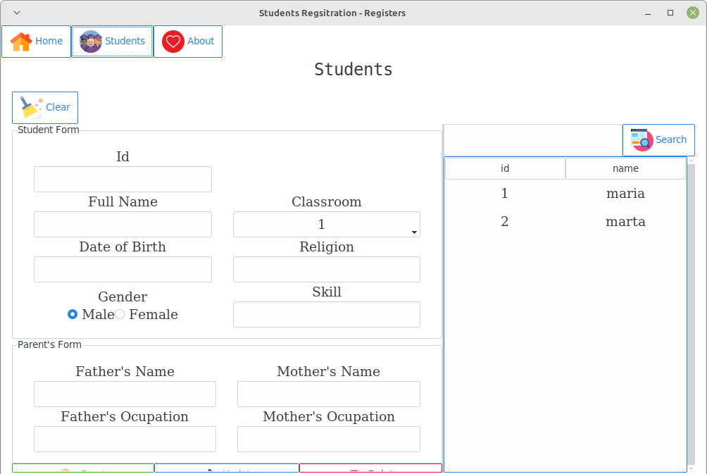

# Students-Manager
This project is a simple student registration system where users can add, update, and delete student records. The project uses the MVC pattern and is built using the tkinter framework.
inspired by this [video](https://www.youtube.com/watch?v=JUGEkFDeuwg "Student Registration System with Database Using Python")

## Installation
To use the project, you must have Python installed on your computer. Once you have installed Python, you can follow these steps to install the project:
1. Clone this repository to your local machine
2. Navigate to the project directory using your terminal or command prompt

## Usage
To use the project, navigate to the project directory and run the command `python main.py`. This will start the application, and you will be able to register, update, and delete student records.`

## Credits
This project was built by myself. :rofl:

## License
This project is licensed under the **MIT License**.

## Sample :camera:

