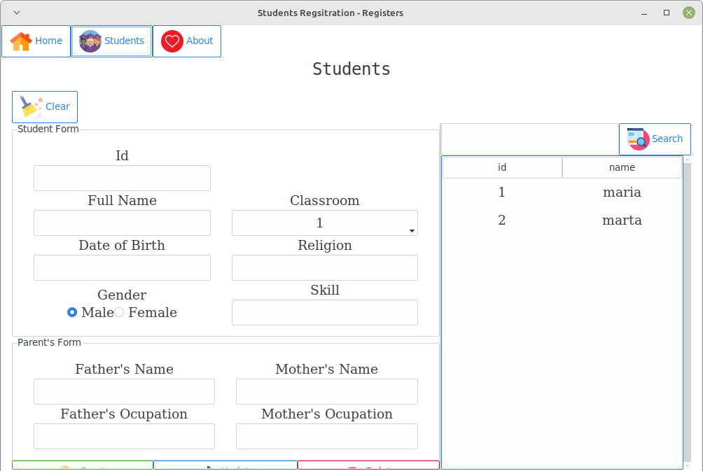

# tk students registration

## about

Hello, this is a python application inspired by this [video](https://www.youtube.com/watch?v=JUGEkFDeuwg "Student Registration System with Database Using Python").

## how  run?
`python3 -m pip install -r requirements.txt`

`python3 main.py`